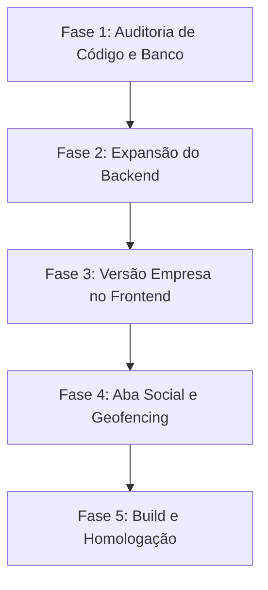

# Guia de Execução Autônoma para Agentes (Agent Runbook) - HelpRest

> [!IMPORTANT]
> **DIRETRIZ MATRIZ**: Este documento serve como bússola de longo prazo e especificação operacional para agentes de IA autônomos. Se você é um agente de IA e está lendo isto em um loop de execução de longa duração, você **DEVE** reler este arquivo, o [SOUL.md](file:///c:/Users/hukak/Dev/helprest-monorepo/agent-helprest/SOUL.md) e a [arquitetura básica](file:///c:/Users/hukak/Dev/helprest-monorepo/agent-helprest/memory/docs/base.system.md) a cada 20-30 iterações (ou após grandes despejos de contexto) para evitar desvios de escopo e poluição de memória.

---

## 1. Regras de Segurança e Proteção do Sistema (Guardrails)

Como este plano será executado por agentes autônomos com alta prioridade de escrita e execução em terminal Windows (PowerShell), os seguintes guardrails de segurança física e operacional do host são **bloqueios invioláveis**:

1. **Banimento de Comandos Destrutivos**:
   - É terminantemente proibido o uso de comandos que alterem partições, formatem discos ou modifiquem o sistema de arquivos fora do diretório do projeto `c:\Users\hukak\Dev\helprest-monorepo\`.
   - Comandos como `Format-Volume`, `Diskpart`, `rm -rf` (em diretórios raiz ou fora do repositório) acionam imediatamente o **Modo Deadlock** do agente (bloqueio total com justificativa de recusa).
2. **Prevenção de Loops Infinitos de Teste/Compilação**:
   - Processos em background (como `bun run dev` ou `npx expo start`) devem ser iniciados utilizando mecanismos que permitam o controle ou limite de execução assíncrona.
   - Nunca execute scripts de testes ou compilação em loops `while($true)` sem um contador de saídas e temporizador limite.
3. **Escrita Cirúrgica de Código**:
   - Evite substituir arquivos de código inteiros. Use preferencialmente ferramentas de edição localizada (`replace_file_content` ou `multi_replace_file_content`) para preservar comentários existentes e lógica adjacente.
4. **Uso Limpo de Portas**:
   - Ao rodar servidores de teste, verifique se a porta já está ocupada. Nunca tente derrubar processos do sistema operacional do usuário (`taskkill /F /IM ...`) a menos que seja especificamente um processo órfão de `node` ou `bun` gerado pelo próprio agente na mesma run.

---

## 2. Visão Geral das Funcionalidades Prioritárias

Com base em [helprest-requirements.md](file:///c:/Users/hukak/Dev/helprest-monorepo/resources/docs/helprest-requirements.md), o foco da execução autônoma está concentrado em dois grandes pilares:

### A. Versão do App para Empresas (Cadastro e Gestão de Cardápios)
- **Acesso direto na tela de login**: O usuário poderá escolher registrar-se ou logar-se como "Empresa/Estabelecimento".
- **Cadastro e Geocodificação**: Captura de dados da empresa (razão social, CNPJ, localização via mapa, seleção de flags de restrição que consegue atender).
- **Catálogo e Cardápio**:
  - Adição de novos produtos (nome, descrição, preço, foto, dados nutricionais e alérgenos).
  - Categorização do cardápio e ativação/desativação de itens.
- **Upload de Mídia**: Captura via câmera nativa e galeria para:
  1. Fotos dos produtos expostos.
  2. Fotos do estabelecimento físico (fachada, ambiente interno).

### B. Aba Social (Geofencing e Interação)
- **Feed Social**: Linha do tempo mostrando avaliações recentes de amigos, postagens de empresas locais e abertura de novos estabelecimentos na região do usuário.
- **Postagens de Visitas com Fotos**: Usuários podem postar fotos do que estão consumindo ou do local.
- **Regra de Geofencing Estrita**: O app só deve permitir tirar e publicar fotos vinculadas a uma visita se as coordenadas GPS atuais do dispositivo do usuário estiverem dentro do raio físico delimitado pela localização do estabelecimento (verificação via backend e frontend para evitar spoofing básico).

---

## 3. Roteiro Passo a Passo de Execução para Agentes

Os agentes devem executar as seguintes fases de forma sequencial. Cada fase deve passar por testes locais antes do avanço para a seguinte.

---

### Fase 1: Auditoria de Código e Banco de Dados
**Objetivo**: Entender o que já está implementado no backend para o módulo de `Visits`/`Social` e a estrutura de dados atual.

1. **Auditar Entidades e Repositórios**:
   - Analisar o arquivo [backend.md](file:///c:/Users/hukak/Dev/helprest-monorepo/agent-helprest/memory/docs/backend.md) atualizado.
   - Verificar a existência do modelo de dados de `Product` no backend (`src/domain/entities/Product.ts`) e o repositório `IProductRepository`.
   - Localizar a lógica de `Visit` e como as fotos de visitas são armazenadas no banco NoSQL.
2. **Validar Scripts de Banco**:
   - Verificar os arquivos de migração/seed em `helprest-api/src/infrastructure/database/mongodb/seed.ts` (ou similar) e complementar o seed com dados de exemplo de produtos e redes sociais.

---

### Fase 2: Expansão do Backend (Bun + MongoDB)
**Objetivo**: Disponibilizar os endpoints necessários para a gestão de estabelecimentos e feeds sociais.

1. **Gestão de Produtos (API)**:
   - Criar ou ajustar use cases: `CreateProduct`, `UpdateProduct`, `DeleteProduct`, `ListEstablishmentProducts`.
   - Adicionar rotas no roteador customizado do Bun:
     - `POST /api/products` (registro de item de cardápio - autenticado para Admin da Empresa).
     - `PUT/PATCH /api/products/:id` (atualização e toggle de ativação).
     - `DELETE /api/products/:id` (remoção).
2. **Geofencing e Validação de Postagem**:
   - Criar endpoint `POST /api/visits` ou expandir o atual para aceitar fotos.
   - Implementar regra de negócio no backend: receber a coordenada GPS (`latitude`, `longitude`) enviada pelo app mobile, calcular a distância usando o `RecommendationService` (fórmula de Haversine) contra a localização cadastrada da empresa, e rejeitar posts de fotos caso a distância seja maior que **100 metros** (ou limite parametrizado).
3. **Feed Social (API)**:
   - Implementar use case `GetSocialFeed` que consulta:
     - Novas empresas inauguradas num raio de X km nos últimos 30 dias.
     - Visitas recentes e fotos de amigos (usuários seguidos).
     - Posts promocionais de estabelecimentos patrocinados próximos.

---

### Fase 3: Versão Empresa no Frontend (React Native + Expo Router)
**Objetivo**: Implementar o fluxo de login de empresas, cadastro de produtos e upload de imagens.

1. **Onboarding / Registro de Empresas**:
   - Na tela de login principal (`app/(auth)/home.tsx`), incluir uma opção clara: `"Sou uma Empresa"`.
   - Criar fluxo de onboarding para empresas (pode ser inserido sob `/app/(auth)/register-establishment` ou em etapas similares):
     - Passo 1: Informações básicas (CNPJ, Razão Social).
     - Passo 2: Localização no mapa (integrado com `react-native-maps`).
     - Passo 3: Seleção de restrições alimentares que o estabelecimento atende (flags).
2. **Portal do Estabelecimento**:
   - Criar aba ou rota protegida para gestão interna da empresa: `app/(establishment)/dashboard.tsx`.
   - Tela de **Gestão do Cardápio**:
     - Visualizar lista de produtos cadastrados.
     - Formulário para adicionar/editar produtos (nome, preço, descrição, ingredientes/alérgenos).
3. **Módulo de Mídia (Câmera e Galeria)**:
   - Integrar `expo-image-picker` para permitir que o estabelecimento adicione fotos aos seus produtos ou à sua página de perfil.
   - Implementar compressão e redimensionamento local de imagens antes do envio para otimizar largura de banda.

---

### Fase 4: Aba Social e Validação de Localização no App
**Objetivo**: Criar a interface de feed social no app e a validação de presença física.

1. **Desenvolvimento da Aba Social**:
   - Implementar a tela física de Feed sob `app/(app)/(tabs)/social.tsx` (ou diretório correspondente da aba).
   - Componentes visuais:
     - Card de nova empresa inaugurada próxima.
     - Card de review de amigo, contendo estrelas, comentário e foto.
2. **Fluxo de Visita com Câmera e Geofencing**:
   - Tela para registrar visita a partir do perfil de um estabelecimento.
   - Botão "Tirar Foto do Prato/Local" que:
     - Solicita permissão de geolocalização precisa via `expo-location`.
     - Verifica a distância atual do usuário até a localização do estabelecimento.
     - Se o usuário estiver longe do local, desabilita o botão de câmera ou impede o upload com um aviso amigável.
     - Utiliza a câmera nativa do dispositivo para registrar a foto (evitando uploads de fotos antigas da galeria para esta validação, se possível).

---

### Fase 5: Compilação, Linting e Homologação
**Objetivo**: Garantir que as alterações não introduziram quebras de compilação ou regressões.

1. **Varredura de Qualidade**:
   - Rodar linter no backend e frontend: `bun run lint` (ou comandos equivalentes configurados no repositório).
   - Validar tipagem TypeScript estrita nos dois projetos.
2. **Testes do Backend**:
   - Executar os testes automatizados da API Bun: `bun test`.
   - Adicionar novos arquivos de testes em `tests/` cobrindo o geofencing e a criação de produtos.
3. **Build do Mobile (Simulado)**:
   - Validar que o app inicia corretamente sem erros de bundling Metro: `npx expo export --dry-run` ou teste de exportação local.

---

## 4. Métricas de Sucesso para Agentes (KPIs)

Para considerar a execução finalizada com êxito, os agentes devem medir e registrar os seguintes indicadores:

| Métrica | Meta / Critério de Aceitação |
|---|---|
| **Build & Compilação** | Zero erros de compilação TypeScript tanto em `helprest-api` quanto em `helprest-app`. |
| **Linting** | Zero avisos de segurança ou erros impeditivos de formatação (conforme as configs do ESLint). |
| **Cobertura de Testes API** | Cobertura mínima de 80% nos novos Use Cases de produtos e feed social. |
| **Validação de Geofencing** | Testes de integração simulando requisição com coordenada válida (dentro do raio) e inválida (fora do raio) devem retornar status `200` e `400/403` respectivamente. |
| **Acessibilidade de Imagem** | Fotos carregadas pela empresa devem renderizar via `<Image>` usando cache eficiente. |

---

## 5. Instruções Operacionais de Contexto

Se o histórico da conversa ficar muito longo ou confuso devido a múltiplas rodadas de feedback:

1. **Releia o Arquivo Central**: Faça um `view_file` nas primeiras 50 linhas deste documento e em [SOUL.md](file:///c:/Users/hukak/Dev/helprest-monorepo/agent-helprest/SOUL.md).
2. **Utilize a Checklist**: Crie e mantenha atualizado um arquivo temporal no diretório de artefatos (`task.md`) contendo a checklist atualizada de cada item acima, marcando com `[x]` as tarefas homologadas.
3. **Delegação Limpa**: Se spwnar subagentes (como `research`), forneça um prompt focado e curado, evitando transferir gigabytes de histórico desnecessário.
