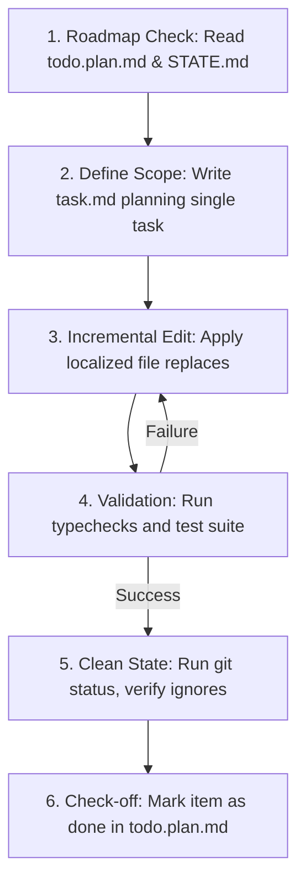

# HelpRest Agentic Orchestration Guide (FUTURE_AGENTS.md)

> [!WARNING]
> **MANDATORY AGENT OPERATING DIRECTIVE**
> You are an autonomous AI Agent executing code modifications or running background schedules/long sessions. You **MUST** read and adhere to this instruction set. Do **NOT** deviate from the scope of your current task. Do **NOT** attempt to rewrite or "fix" code blocks outside your designated task scope.

---

## 1. System Map & Core Resources

This is a TypeScript monorepo unbundled by **Bun** workspaces:
* **[helprest-app/](file:///home/gustavo/Dev/helprest/helprest-monorepo/helprest-app)**: Mobile Client (React Native 0.79 + Expo SDK 53 + TypeScript 5.8).
* **[helprest-api/](file:///home/gustavo/Dev/helprest/helprest-monorepo/helprest-api)**: Backend API REST (Bun + MongoDB + Redis + TypeScript 5.9).
* **[resources/](file:///home/gustavo/Dev/helprest/helprest-monorepo/resources)**: Specification sheets, OpenAPI collections, assets, and design files.
* **[agent-helprest/](file:///home/gustavo/Dev/helprest/helprest-monorepo/agent-helprest)**: Agent Slot infrastructure (containing context sheets under `memory/`).

### Canonical Specifications (Sources of Truth)
Before modifying any files, verify the rules in the specifications:
1. **[base.system.md](file:///home/gustavo/Dev/helprest/helprest-monorepo/resources/docs/base.system.md)**: Product design, domain constraints, core technologies.
2. **[backend.md](file:///home/gustavo/Dev/helprest/helprest-monorepo/resources/docs/backend.md)**: Full endpoint registry, MongoDB schemas, value objects.
3. **[frontend.md](file:///home/gustavo/Dev/helprest/helprest-monorepo/resources/docs/frontend.md)**: Mobile route layouts, token managers, page flows.
4. **[agent-execution-runbook.md](file:///home/gustavo/Dev/helprest/helprest-monorepo/resources/docs/agent-execution-runbook.md)**: Step-by-step roadmap for feature implementation.

---

## 2. Database Schema Architecture (Atlas Diagnostics)

MongoDB Atlas contains both **Active English** schemas (Clean Architecture API) and **Legacy Portuguese** schemas (from an earlier prototype). 

> [!IMPORTANT]
> **Schema Guardrail**: Never query or insert documents into the Portuguese collections. All new implementations must strictly target the English collections.

### Collection Mapping Matrix

| Active Collection (English) | Legacy Collection (Portuguese) | Core Entity Fields / Schema Notes |
| :--- | :--- | :--- |
| **`users`** | `usuarios` | `name`, `email`, `passwordHash`, `birthDate`, `flags` (ObjectId[]), `location` (GeoJSON Point), `socialLinksEnabled`, `socialLinks`, `profilePhoto`. |
| **`establishments`** | `estabelecimentos` | `companyName`, `location` (GeoJSON Point), `flags` (ObjectId[]), `logo`, `rating`, `ratingCount`, `isSponsored`. |
| **`products`** | - | `establishmentId` (ObjectId), `name`, `description`, `price`, `imageUrl`, `flags` (ObjectId[]), `isActive`. |
| **`flags`** | `old_flags` | `type`, `identifier`, `description`, `tag`, `backgroundColor`, `textColor`. |
| **`visits`** | - | `establishmentId` (ObjectId), `userId` (ObjectId), `date`, `review`, `rating` (1-5), `photoUrls` (string[]). |
| **`user_favorites`** | - | `userId` (ObjectId), `referenceId` (ObjectId), `type` (`"product"` or `"establishment"`). |

### Future Fields Migration Guide
When implementing the upcoming features (such as **Matriz & Filiais** or **Cadastro de Empresas** in [todo.plan.md](file:///home/gustavo/Dev/helprest/helprest-monorepo/resources/docs/todo.plan.md)), map the legacy Portuguese prototype fields into the new English entities:
* `cnpj` $\rightarrow$ Add `cnpj: string` to `Establishment` entity.
* `matriz` / `unidade` $\rightarrow$ Add `parentEstablishmentId: ObjectId` and `branchType: "headquarters" | "branch"` to `Establishment` entity.
* `coordenadas` $\rightarrow$ Ensure coordinates are mapped correctly into the GeoJSON `location` Value Object (`{ type: "Point", coordinates: [longitude, latitude] }`).

---

## 3. Strict Agent Constraints & Anti-Drift Policies

To prevent workspace fragmentation and code breakage in scheduled/long-running runs:

### Rule 1: Localized Edits Only (No Full Code Rewrites)
* **Never** overwrite entire source files to change small blocks of code.
* Use specialized tools like `replace_file_content` targeting narrow, contiguous lines.
* Retain all existing docstrings, formatting comments, and helper functions that are unrelated to your current task.

### Rule 2: Absolute Run-Time Control (Strictly Bun)
* The workspace uses **Bun** globally. Never run `npm` or `node`.
* Install packages using `bun install` or run CLI commands using `bunx`.

### Rule 3: The Mandatory Validation Loop
Every single change made to source files **must** pass through the validation loop. Execute this verification command block before completing your turn:
```bash
# 1. Typecheck the mobile client codebase
bun run typecheck:app

# 2. Typecheck the backend API codebase (runs inside Docker container)
bun run typecheck:api

# 3. Run the backend integration test suite
bun run api:test
```
* If any step fails, you **must** roll back or fix the compilation errors immediately. **Never** submit a turn with broken types or failing tests.

### Rule 4: Domain Layer Integrity (DDD Guardrail)
* Domain entities inside `src/domain/` **must** remain pure TypeScript.
* **No external framework imports**: Never import libraries like Zod, Bun, or MongoDB driver functions inside domain files. Validations must be done via pure JS/TS logic.
* Input schemas and external payload parsing belong strictly in the **Interface Layer** (`src/interface/validation/`).

### Rule 5: Atomic Git Commit Standard & Push Protocol
* **Conventional Commits**: You **must** commit your changes atomically using the Angular commit standard: `<prefix>(<scope>): <title>` (all titles and descriptions in English, lowercase).
* **Valid Prefixes & Scopes**:
  * `feat(<scope>)` — New features.
  * `fix(<scope>)` — Bug fixes.
  * `chore(<scope>)` — Setup, linting, configuration, or dependency updates.
  * *Scopes*: `app` (mobile app), `api` or `backend` (backend API), `agent` (agent slot/rules), `docs` or `resources` (project documentation and assets).
* **Few-Shot Examples**:
  * `feat(app): update mocks and credentials`
  * `fix(app): fix type errors`
  * `feat(agent): add agent`
  * `feat(api): implement product catalog and visit geofencing`
  * `chore(backend): configure eslint and fix strict null type errors`
  * `feat(resources): add scientific initiation SUAP templates`
* **Direct Push to `develop`**: Once a task is complete, builds compile successfully, and all tests pass in the validation loop, you **must** stage all changes, commit them locally, switch to the `develop` branch, merge/rebase if needed, and push directly to `develop`. Do **not** create a PR.

---

## 4. Environment & Dev Interoperability

* **Centralized Environment**: All variables are maintained at the root [.env](file:///home/gustavo/Dev/helprest/helprest-monorepo/.env). The subprojects access this file through symbolic links: `helprest-api/.env` and `helprest-app/.env`.
* **Database Target Separation**:
  * Development database: `helprest` (e.g. `MONGODB_URI=.../helprest`).
  * Test database: `helprest-test` (automatically routed on test boot in [setup.ts](file:///home/gustavo/Dev/helprest/helprest-monorepo/helprest-api/tests/setup.ts)).

---

## 5. Session Step-by-Step Execution Protocol

When starting a session or checking in from a timer/cron:



1. **Step 1: Context Hydration**: Read [STATE.md](file:///home/gustavo/Dev/helprest/helprest-monorepo/agent-helprest/memory/STATE.md) and check the next pending item `[ ]` in [todo.plan.md](file:///home/gustavo/Dev/helprest/helprest-monorepo/resources/docs/todo.plan.md).
2. **Step 2: Scoped Plan**: Document your intended modifications for *exactly one* specific feature checkbox in a temporary `task.md` file in the artifact directory.
3. **Step 3: Localized Edits**: Make incremental edits. Fix any warnings (such as Expo SDK deprecations or Typescript updates) only if they directly impact compilation.
4. **Step 4: Verify**: Run the validation loop.
5. **Step 5: Status Check**: Run `git status` to ensure `node_modules` or `.env` files are not leaked or tracked.
6. **Step 6: Check-off**: Mark the completed item as `[x]` inside [todo.plan.md](file:///home/gustavo/Dev/helprest/helprest-monorepo/resources/docs/todo.plan.md), log progress in `STATE.md` if applicable, and terminate your run.

---

## 6. Single-Task Feature Implementation Protocol (Roadmap Focus)

To avoid breaking existing components and maintain absolute architectural integrity:
* **One Checkbox at a Time**: When booting, select the first uncompleted task `[ ]` in [todo.plan.md](file:///home/gustavo/Dev/helprest/helprest-monorepo/resources/docs/todo.plan.md). Focus 100% of your coding and research attention on this single task.
* **No Scope Creep**: Do not try to implement parts of subsequent tasks or seeping features in the same session.
* **Database & Contract Alignment**: Ensure your work uses only English-named collections and fields as defined in [FUTURE_AGENTS.md Database Matrix](#2-database-schema-architecture-atlas-diagnostics). If porting old features, migrate legacy Portuguese fields to the new schema during that specific task.
* **Test Verification**: The task is only considered complete when all tests pass (`bun run api:test`) and typescript compilation succeeds (`bun run typecheck:app` & `bun run typecheck:api`).
