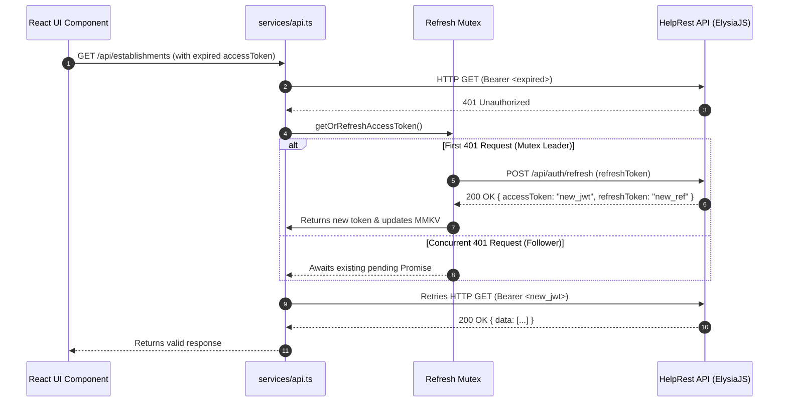

# HelpRest Frontend — Architecture, Patterns & Screen Mapping

## 1. Overview

The HelpRest mobile application is built with **React Native 0.79** + **Expo SDK 53** using **Expo Router v5** for file-based navigation, **TanStack Query v5** for server-state synchronization, **MMKV** for high-performance offline persistence, and **TypeScript** strictly configured throughout.

- **Dev Start:** `bun run app:start` or `npx expo start`
- **Android Dev Client / Local Build:** `bun run app:build:apk` or `npx expo run:android`
- **Lint & Typecheck:** `bun run lint:app && bun run typecheck:app`

---

## 2. Technology Stack & Key Libraries

| Category | Technology | Role / Purpose |
|---|---|---|
| Framework | **React Native 0.79 + Expo SDK 53** | Cross-platform core runtime |
| Navigation | **Expo Router v5** | Typed, file-based routing with deep linking & slot grouping |
| Server State | **TanStack Query v5** | Request caching, background deduping, optimistic mutations |
| Key Management | **`queryKeys` Factory** | Strongly-typed query key hierarchy eliminating magic strings |
| Local Storage | **MMKV (`react-native-mmkv`)** | Sub-millisecond encrypted key-value store with domain isolation |
| HTTP Client | **`services/api.ts`** | Centralized client with single-flight mutex auto-refresh |
| Geolocation | **`expo-location` + OpenStreetMap** | Reverse geocoding and device coordinates capture |
| Maps | **`react-native-maps`** | Interactive vector map with custom restaurant pins |
| Authentication | **`expo-auth-session`** | Native Google OAuth2 authentication flow |
| Visual Assets | **`expo-image`** | Optimized caching and performant image rendering |
| Micro-interactions | **`react-native-reanimated`** | Gesture-driven bottom sheets and smooth transitions |

---

## 3. Directory Architecture & Atomic Hierarchy

```
helprest-app/
├── app/                           # Expo Router file-based route hierarchy
│   ├── _layout.tsx                # Root layout (QueryClientProvider, AuthGate, GestureHandlerRootView)
│   ├── index.tsx                  # Initial splash redirect based on auth & onboarding status
│   ├── (auth)/                    # Unauthenticated route group
│   │   ├── home.tsx               # Login screen (Google OAuth2 + guest gateway)
│   │   └── register/              # Multi-step onboarding stack
│   │       ├── step1.tsx          # Name & basic profile
│   │       ├── step2.tsx          # Date of birth validation
│   │       ├── step3.tsx          # Location / default address selection
│   │       └── step4.tsx          # Dietary restrictions & allergens flag picker
│   └── (app)/                     # Protected route group (auth guard enforced)
│       ├── _layout.tsx            # Protected shell
│       ├── (tabs)/                # Primary bottom tab navigator
│       │   ├── (home)/index.tsx   # Interactive map view + nearby establishment discovery
│       │   ├── (places)/index.tsx # Categorized discovery ("Para Você", "Novidades", "Próximos")
│       │   └── (social)/index.tsx # Social activity feed, reviews & check-in timeline
│       └── details/
│           └── [id].tsx           # Detailed establishment profile, menus, flags & reviews
├── components/                    # Atomic Component Design System
│   ├── atoms/                     # Foundational atomic units
│   │   ├── MiddleDot.tsx          # Separator dot for metadata lines
│   │   └── TextDistance.tsx       # Formatted distance badge
│   ├── ui/                        # Molecules and composite components
│   │   ├── Card.tsx               # Primary vertical establishment card
│   │   ├── CardHorizontal.tsx     # Horizontal recommendation carousel card
│   │   ├── FlagColoredText.tsx    # Styled badge matching domain flag colors
│   │   ├── HeartClicable.tsx      # Interactive animated favorite toggle
│   │   ├── IconCircle.tsx         # Circular icon container
│   │   ├── ImageRounded.tsx       # Cached rounded image with fallback
│   │   ├── ProductBottomSheet.tsx # Detailed food item bottom sheet
│   │   ├── ProfileSheet.tsx       # User profile management sheet
│   │   ├── StarReview.tsx         # Rating score star bar
│   │   └── UserBar.tsx            # Top header bar with greeting, location & profile trigger
│   └── login/                     # Onboarding and auth specific molecules
├── constants/                     # Centralized immutable constants
│   ├── Colors.ts                  # Light / dark design system color tokens
│   └── queryKeys.ts               # Strongly-typed TanStack Query Key Factory
├── hooks/                         # Custom React hooks
│   ├── queries/                   # Encapsulated query hooks (useFavorites, usePlacesQuery, etc.)
│   ├── usePermissions.ts          # Location permissions requester & handler
│   ├── useThemeColor.ts           # Dynamic theme resolver
│   └── useDebounce.ts             # Value debouncer for search bars
├── services/                      # Infrastructure & network abstractions
│   ├── api.ts                     # HTTP client with single-flight mutex token refresh
│   ├── auth.ts                    # Google OAuth2 integration service
│   └── location.ts                # Geolocation and Nominatim reverse geocoding
└── storage/                       # Isolated MMKV persistence modules
    ├── keys.ts                    # Strongly typed storage keys and instance identifiers
    ├── authTokens.ts              # JWT Access/Refresh tokens & Google profile
    ├── userProfile.ts             # Cached user profile & onboarding progress
    └── userLoginStatus.ts         # Fast-path login flag
```

---

## 4. Navigation Flow & Screen Mapping

```mermaid
flowchart TD
    AppLaunch([App Launch]) --> CheckAuth{Tokens in MMKV?}
    
    CheckAuth -- No --> AuthHome[/(auth)/home\nLogin Screen]
    CheckAuth -- Yes --> CheckOnboarding{Onboarding Complete?}
    
    AuthHome -->|Google Sign In Success| CheckNewUser{isNewUser?}
    CheckNewUser -- Yes --> Step1[/(auth)/register/step1\nName]
    CheckNewUser -- No --> CheckOnboarding
    
    Step1 --> Step2[/(auth)/register/step2\nBirth Date]
    Step2 --> Step3[/(auth)/register/step3\nLocation / Address]
    Step3 --> Step4[/(auth)/register/step4\nDietary Flags]
    Step4 -->|PATCH /api/users/me| MainTabs[/(app)/(tabs)]
    
    CheckOnboarding -- Incomplete --> Step1
    CheckOnboarding -- Complete --> MainTabs
    
    subgraph ProtectedApp [/(app) Protected Space]
        MainTabs --> TabHome[/(home)\nInteractive Map & Pins]
        MainTabs --> TabPlaces[/(places)\nDiscovery & Recommendations]
        MainTabs --> TabSocial[/(social)\nCommunity Feed & Reviews]
        
        TabHome -.-> Details[/(app)/details/[id]\nEstablishment Detail & Menu]
        TabPlaces -.-> Details
        TabSocial -.-> Details
        
        Details -.-> ProductModal[Product Bottom Sheet\nIngredients & Allergens]
        TabHome -.-> ProfileDrawer[Profile Bottom Sheet\nEdit Dietary Flags & Logout]
    end
```

---

## 5. API Integration & Server State Architecture

### 5.1 Query Key Factory Topology

All cache keys are structured hierarchically using `queryKeys`:

```ts
queryKeys.establishments.all; // ["establishments"]
queryKeys.establishments.list({ page: 1, limit: 50 }); // ["establishments", "list", { page: 1, limit: 50 }]
queryKeys.establishments.recommended(userCoords); // ["establishments", "recommended", -25.42, -49.26]
queryKeys.establishments.detail(establishmentId); // ["establishments", "detail", "66..."]
queryKeys.flags.all; // ["flags"]
queryKeys.favorites.all; // ["favorites"]
queryKeys.visits.socialFeed(userCoords); // ["visits", "socialFeed", -25.42, -49.26]
```

### 5.2 Mutex Single-Flight Token Auto-Refresh Lifecycle



---

## 6. MMKV Storage Domains

| Domain / Instance ID | Module | Keys Stored | Purpose |
|---|---|---|---|
| `auth-tokens` | `storage/authTokens.ts` | `accessToken`, `refreshToken`, `googleUser` | Secure authentication persistence |
| `user-profile` | `storage/userProfile.ts` | `profile` | User entity snapshot, dietary flags & profile coordinates |
| `app-state` | `storage/userLoginStatus.ts` | `userLoginStatus`, `is_company_onboarding` | Fast boolean flags for instant startup checks |
