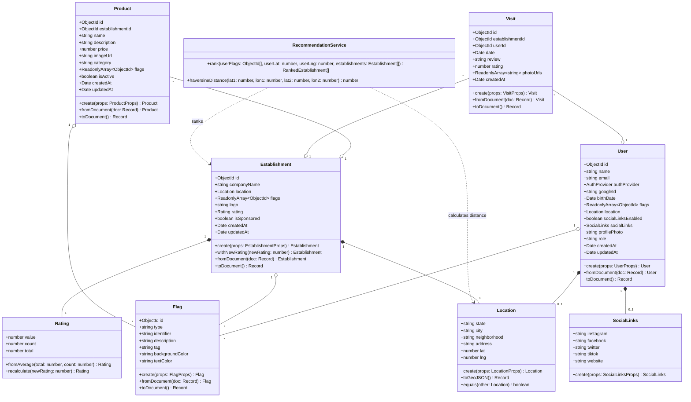
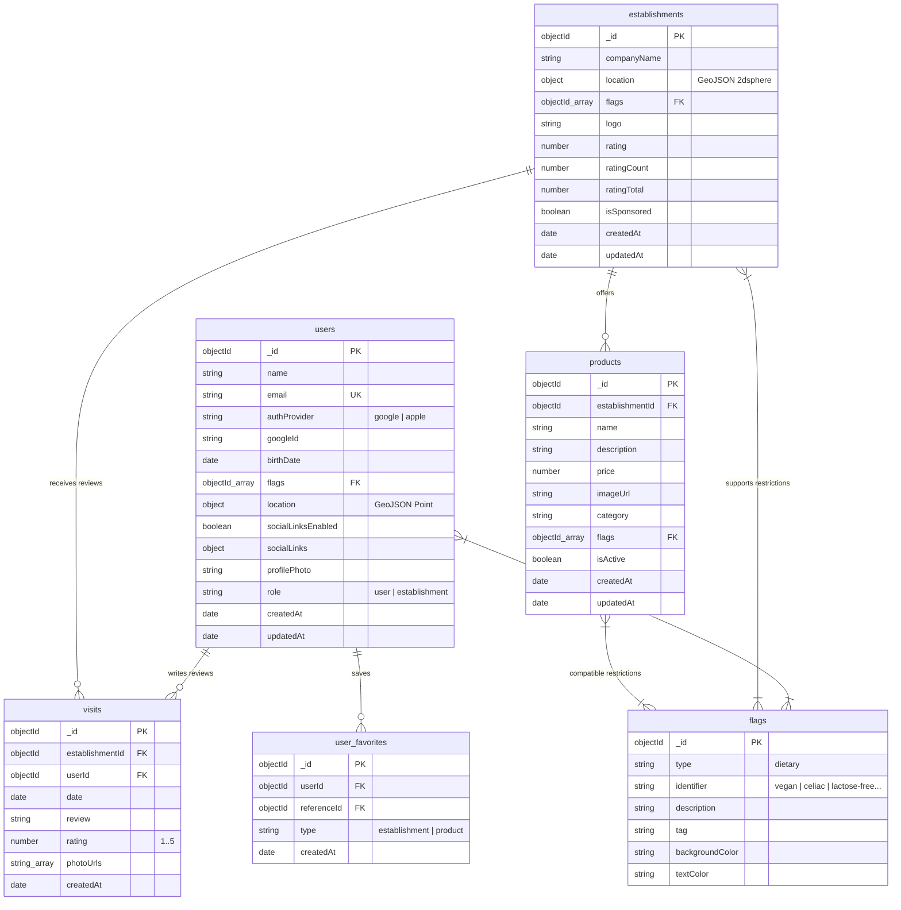
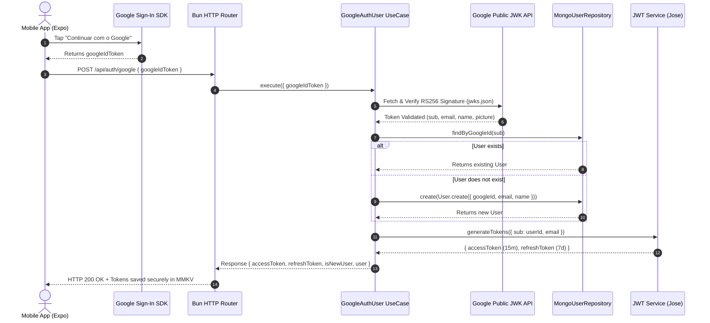
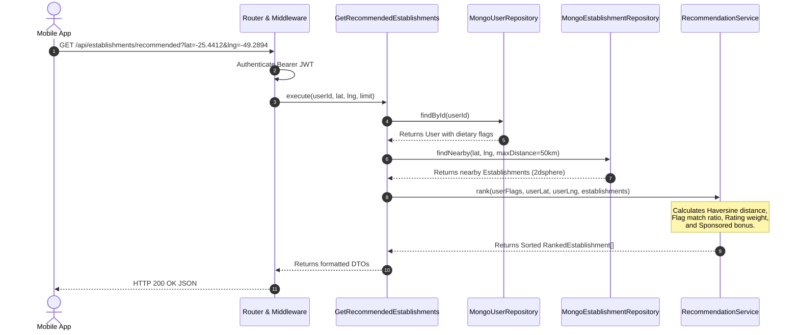

# HelpRest Backend — Architecture & Patterns

## Overview

The HelpRest API is a RESTful backend built with **Bun** runtime, **MongoDB** (official driver, no ODM), and **Redis** for caching/rate-limiting. It follows **Clean Architecture** with **Domain-Driven Design (DDD)** organization.

**Entry point:** `src/index.ts`  
**Dev command:** `bun run dev` (auto-restarts on changes)  
**Seed command:** `bun run seed` (populates database with test data)  
**Test command:** `bun test`  
**API test file:** `resources/api/api.http` (VS Code REST Client)  
**Insomnia collection:** `resources/api/insomnia.json`

---

## Architecture Layers

```
src/
├── domain/          → Business rules (zero external dependencies)
├── application/     → Use cases / orchestration
├── infrastructure/  → Database, cache, security implementations
├── interface/       → HTTP server, middleware, validation
└── shared/          → Errors, utilities, types
```

**Dependency Rule:** Dependencies always point inward → `interface → application → domain`. Never the reverse. Infrastructure implements domain contracts.

---

## Domain Layer (`src/domain/`)

### Entities

| Entity | File | Key Fields |
|---|---|---|
| `User` | `entities/User.ts` | name, email, passwordHash?, authProvider (local/google), googleId?, birthDate?, flags (ObjectId[]), location, socialLinks, profilePhoto |
| `Establishment` | `entities/Establishment.ts` | companyName, location (GeoJSON), flags, logo, rating, ratingCount, isSponsored |
| `Product` | `entities/Product.ts` | establishmentId, category, name, description, price, imageUrl, isActive |
| `Flag` | `entities/Flag.ts` | type, identifier, description, tag, backgroundColor, textColor |
| `Visit` | `entities/Visit.ts` | establishmentId, userId, date, review, rating (1-5) |

All entities:
- Are created via static `create()` factory with validation
- Serialized/deserialized via `toDocument()` / `fromDocument()` for MongoDB
- Immutable after creation (use `withNewRating()` pattern for updates)

### Value Objects (`value-objects/`)

- **`Location`** — state, city, neighborhood, address, coordinates. Has `toGeoJSON()` for MongoDB 2dsphere queries.
- **`SocialLinks`** — instagram, facebook, twitter, tiktok, website.
- **`Rating`** — 0-5 with `fromAverage(total, count)` factory.

### Repository Interfaces (`repositories/`)

Abstract contracts implemented by infrastructure layer:
- `IUserRepository` — CRUD + `findByEmail()`
- `IEstablishmentRepository` — CRUD + `findNearby()` (geospatial) + `findByFlags()` + `search()` (text) + `findSponsored()`
- `IProductRepository` — `findByEstablishmentId()`, `save()`, `delete()`
- `IFlagRepository` — CRUD + `findByIds()` + `findByType()`
- `IVisitRepository` — CRUD + `findByUserId()` + `findByEstablishmentId()` + `countByEstablishment()`

### Domain Services (`services/`)

**`RecommendationService`** — Core recommendation algorithm:
- Score = `flagMatchRatio * 0.5 + ratingNormalized * 0.3 + proximityScore * 0.2 + sponsorBonus`
- Uses Haversine formula for distance calculation
- Stateless, pure logic, no external dependencies

---

## Application Layer (`src/application/`)

### Use Cases

| Module | Use Cases |
|---|---|
| `auth/` | `RegisterUser`, `LoginUser`, `RefreshToken`, `GoogleAuthUser` |
| `user/` | `GetUserProfile`, `UpdateUserProfile`, `UpdateUserFlags` |
| `establishment/` | `ListEstablishments`, `GetEstablishment`, `GetRecommendedEstablishments`, `GetNearbyEstablishments`, `SearchEstablishments`, `CreateEstablishment` |
| `product/` | `ListEstablishmentProducts` |
| `flag/` | `ListFlags`, `CreateFlag` |
| `visit/` | `CreateVisit` (auto-recalculates establishment rating), `ListUserVisits`, `GetEstablishmentVisits` |

Each use case:
- Receives validated input (from Zod schemas)
- Returns DTOs (never exposes domain entities directly)
- Takes repository interfaces via constructor injection

---

## Infrastructure Layer (`src/infrastructure/`)

### MongoDB (`database/mongodb/`)

- **`connection.ts`** — Singleton MongoClient with connection pooling (max 10, min 2)
- **`collections.ts`** — Collection name constants + typed accessor functions
- **`indexes.ts`** — Creates all indexes on startup:
  - `2dsphere` on `establishments.location.coordinates` (geospatial)
  - `text` on `establishments.companyName` (search)
  - `unique` on `users.email`
  - Compound indexes for visits and sponsored sort

### Redis (`database/redis/`)

- Lazy-connected singleton (`ioredis`)
- Won't crash the app if unavailable (graceful degradation)

### Repositories (`repositories/`)

MongoDB implementations of domain contracts:
- `MongoUserRepository`, `MongoEstablishmentRepository`, `MongoFlagRepository`, `MongoVisitRepository`
- Establishment repo uses `$geoNear` aggregation pipeline for proximity queries
- All use `fromDocument()` / `toDocument()` for entity mapping

### Security (`security/`)

- **`jwt.ts`** — Access tokens (15min) + refresh tokens (7d), rotated. Uses `jose` library with HS256.
- **`password.ts`** — Argon2id hashing (64MB memory cost, 3 iterations).
- **`rateLimiter.ts`** — Sliding window via Redis sorted sets. Configs: AUTH (10/min), API (100/min), SEARCH (30/min).

### Cache (`cache/`)

- **`RedisCacheService`** — Generic get/set/delete with TTL and prefix-based invalidation.

---

## Interface Layer (`src/interface/`)

### HTTP Router (`http/router.ts`)

Custom URL pattern-matching router for Bun.serve:
- Supports `:param` URL parameters
- Routes are registered via `addRoute(method, path, handler)`
- Automatic Zod validation via helpers `parseBody()` and `parseQuery()`
- Input sanitization against NoSQL injection on every request body

### Middleware (`http/middleware/`)

| Middleware | Purpose |
|---|---|
| `auth.middleware.ts` | Extracts Bearer token, verifies JWT, returns `TokenPayload` |
| `error.middleware.ts` | Catches `AppError` → structured JSON; unknown errors → 500 |
| `cors.middleware.ts` | Configurable origins via `CORS_ORIGINS` env, handles OPTIONS preflight |
| `security.middleware.ts` | HSTS, X-Content-Type-Options, X-Frame-Options, Referrer-Policy |

### Validation Schemas (`validation/`)

Zod v4 schemas with type inference for each endpoint group:
- `auth.schema.ts` — register, login, refresh
- `user.schema.ts` — updateProfile, updateFlags
- `establishment.schema.ts` — create, list, nearby, search
- `visit.schema.ts` — create, list

---

## API Endpoints

### Auth (public)
| Method | Route | Description |
|---|---|---|
| `POST` | `/api/auth/register` | Register + return tokens |
| `POST` | `/api/auth/login` | Login + return tokens |
| `POST` | `/api/auth/refresh` | Rotate refresh token |
| `POST` | `/api/auth/google` | Google OAuth2 login (verify ID token, find-or-create user) |

### Users (authenticated)
| Method | Route | Description |
|---|---|---|
| `GET` | `/api/users/me` | Current user profile |
| `PATCH` | `/api/users/me` | Update profile |
| `PATCH` | `/api/users/me/flags` | Update dietary flags |

### Establishments (authenticated)
| Method | Route | Description |
|---|---|---|
| `GET` | `/api/establishments` | Paginated list |
| `GET` | `/api/establishments/recommended` | Flag-ranked recommendations |
| `GET` | `/api/establishments/nearby` | Geospatial proximity |
| `GET` | `/api/establishments/search` | Text search |
| `GET` | `/api/establishments/:id` | Detail |
| `GET` | `/api/establishments/:id/products` | Cardápio (Products) of Establishment |
| `POST` | `/api/establishments` | Create |

### Flags (public GET)
| Method | Route | Description |
|---|---|---|
| `GET` | `/api/flags` | List all dietary flags |
| `POST` | `/api/flags` | Create flag (authenticated) |

### Visits (authenticated)
| Method | Route | Description |
|---|---|---|
| `POST` | `/api/visits` | Create visit/review |
| `GET` | `/api/visits/user/:userId` | User's visit history |
| `GET` | `/api/visits/establishment/:id` | Establishment reviews |

### System
| Method | Route | Description |
|---|---|---|
| `GET` | `/api/health` | Health check |

---

## Testing Endpoints (`api.http`)

O arquivo `resources/api/api.http` é o **padrão** para documentar e testar endpoints. Usa a extensão [REST Client](https://marketplace.visualstudio.com/items?itemName=humao.rest-client) do VS Code. Para Insomnia, importe `resources/api/insomnia.json`.

**Regras:**
- Todo novo endpoint **deve** ser adicionado ao `api.http` com um example request.
- O login request é `@name login` — seu token é propagado automaticamente via `{{accessToken}}`.
- Agrupe requests por seção (AUTH, USER, ESTABLISHMENTS, etc.).
- Inclua body de exemplo para POST/PATCH.
- Para Insomnia/Bruno: importe o `api.http` diretamente.

---

## Environment Variables

All defined in `.env` (gitignored) with `.env.example` for reference:

| Variable | Purpose |
|---|---|
| `PORT` | Server port (default: 3000) |
| `NODE_ENV` | development / production / test |
| `MONGODB_URI` | MongoDB Atlas connection string |
| `REDIS_URL` | Redis connection URL |
| `JWT_SECRET` | HMAC secret for access tokens |
| `JWT_REFRESH_SECRET` | HMAC secret for refresh tokens |
| `JWT_ACCESS_EXPIRATION` | Access token TTL (default: 15m) |
| `JWT_REFRESH_EXPIRATION` | Refresh token TTL (default: 7d) |
| `CORS_ORIGINS` | Comma-separated allowed origins (default: *) |
| `GOOGLE_OAUTH_CLIENT_ID` | Google OAuth2 client ID for ID token verification |

---

## Shared Utilities (`src/shared/`)

### Error Hierarchy (`errors/`)

All extend `AppError`:
- `NotFoundError` (404)
- `UnauthorizedError` (401)
- `ForbiddenError` (403)
- `ValidationError` (400) — includes field-level error details
- `ConflictError` (409)
- `RateLimitError` (429)

### Utils
- **`sanitize.ts`** — Strips MongoDB query operators (`$gt`, `$ne`, etc.) to prevent NoSQL injection
- **`logger.ts`** — Structured JSON logger with request ID correlation

---

## Path Aliases

Configured in `tsconfig.json`:

| Alias | Target |
|---|---|
| `@domain/*` | `src/domain/*` |
| `@application/*` | `src/application/*` |
| `@infra/*` | `src/infrastructure/*` |
| `@interface/*` | `src/interface/*` |
| `@shared/*` | `src/shared/*` |

---

## Testing

- **Runner:** Bun Test Runner (configured in `bunfig.toml`)
- **Setup:** `tests/setup.ts` — sets isolated env vars
- **Unit tests:** `tests/unit/` — domain entities, value objects, recommendation service
- **Integration tests:** `tests/integration/` — repositories, HTTP controllers

---

## Running Locally

```bash
cd helprest-api
cp .env.example .env      # Configure your MongoDB URI
bun install
bun run dev               # Starts with --watch
```

## Key Design Decisions

1. **No ODM (Mongoose)** — Uses official MongoDB driver for performance and control
2. **Jose over jsonwebtoken** — Modern ESM-native JWT library, smaller bundle
3. **Zod v4** — Runtime validation with TypeScript type inference
4. **OAuth-Only Authentication** — Centralized via Google OAuth ID Token verification server-side using `jose.createRemoteJWKSet`, eliminating local password storage/hashing overhead and reducing attack surface
5. **Repositories as singletons** — Stateless, instantiated once in router
6. **Use cases per-request** — Created fresh per handler call for isolation
7. **Immutable entities** — Updates return new instances (`withNewRating()`)
8. **Google OAuth server-side** — Uses `jose.createRemoteJWKSet` to verify Google ID tokens with Google's public JWK set; no Google SDK required on backend

---

## Visual Architecture Diagrams (Mermaid)

### Domain Class Diagram (Entities, Value Objects & Domain Services)



### NoSQL DER Diagram (MongoDB Collections & Relationships)



### Data Flow & Sequence Diagrams

#### 1. Google OAuth Authentication Flow



#### 2. Recommendation & Proximity Algorithm Flow



