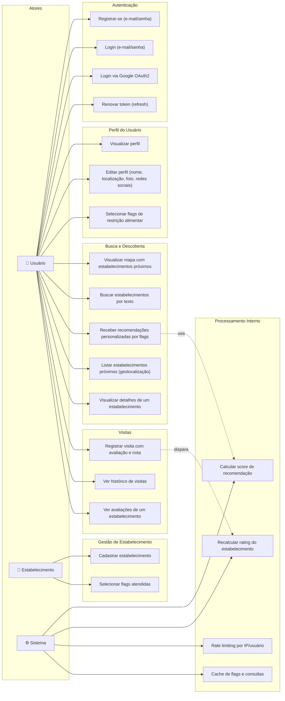

# HelpRest — Diagrama de Casos de Uso

## Atores

| Ator | Descrição |
|---|---|
| **Usuário** | Pessoa com restrições alimentares que busca estabelecimentos compatíveis |
| **Estabelecimento** | Restaurante ou negócio alimentar que se cadastra para ser encontrado por usuários |
| **Sistema** | Motor algorítmico de recomendação e gerenciamento interno |

---

## Diagrama

---

## Descrição dos Casos de Uso

### Autenticação

| Caso de Uso | Descrição |
|---|---|
| **UC1 — Registrar-se** | Usuário cria conta via e-mail e senha. Retorna par de tokens JWT. |
| **UC2 — Login** | Usuário autentica com e-mail/senha existentes. |
| **UC3 — Login via Google** | Usuário se autentica via Google OAuth2. ID Token é verificado pelo backend. Cria conta se não existir; caso contrário retorna ao home. |
| **UC4 — Renovar token** | O app renova automaticamente o access token usando o refresh token rotativo. |

### Perfil do Usuário

| Caso de Uso | Descrição |
|---|---|
| **UC5 — Visualizar perfil** | Mostra dados do perfil do usuário autenticado (`GET /api/users/me`). |
| **UC6 — Editar perfil** | Atualiza nome, data de nascimento, localização, foto e redes sociais. |
| **UC7 — Selecionar flags** | Usuário escolhe suas restrições alimentares (veganismo, intolerância a lactose, glúten, etc.). Essas flags são o núcleo do algoritmo de recomendação. |

### Busca e Descoberta

| Caso de Uso | Descrição |
|---|---|
| **UC8 — Mapa** | Aba principal do app mostra mapa com pins de estabelecimentos compatíveis nas proximidades. |
| **UC9 — Busca por texto** | Pesquisa por nome de estabelecimento via índice de texto do MongoDB. |
| **UC10 — Recomendações** | Retorna estabelecimentos ranqueados pelo `RecommendationService` com base nas flags do usuário, distância, rating e patrocínio. |
| **UC11 — Estabelecimentos próximos** | Consulta geoespacial (`$geoNear`) retorna locais por proximidade. |
| **UC12 — Detalhes** | Visualiza informações completas do estabelecimento: fotos, flags, avaliações, distância, links. |

### Visitas e Avaliações

| Caso de Uso | Descrição |
|---|---|
| **UC13 — Registrar visita** | Usuário cria review com nota (1–5) e análise textual. Dispara recálculo do rating do estabelecimento. |
| **UC14 — Histórico de visitas** | Lista todas as visitas do usuário autenticado. |
| **UC15 — Avaliações do estabelecimento** | Lista todas as reviews de um estabelecimento específico. |

### Gestão de Estabelecimento

| Caso de Uso | Descrição |
|---|---|
| **UC16 — Cadastrar estabelecimento** | Registra um novo estabelecimento com nome, localização (GeoJSON), logo, etc. |
| **UC17 — Selecionar flags** | Estabelecimento indica quais restrições alimentares consegue atender. |

### Processamento Interno (Sistema)

| Caso de Uso | Descrição |
|---|---|
| **UC18 — Score de recomendação** | Fórmula: `flagMatch×0.5 + rating×0.3 + proximidade×0.2 + bônus patrocínio`. Usa Haversine para distância. |
| **UC19 — Recalcular rating** | Após cada nova visita, o rating médio do estabelecimento é atualizado. |
| **UC20 — Rate limiting** | Limites por tipo: AUTH (10/min), API (100/min), SEARCH (30/min). Implementado via Redis sliding window. |
| **UC21 — Cache** | Flags e consultas frequentes cacheadas em Redis com TTL e invalidação por prefixo. |
