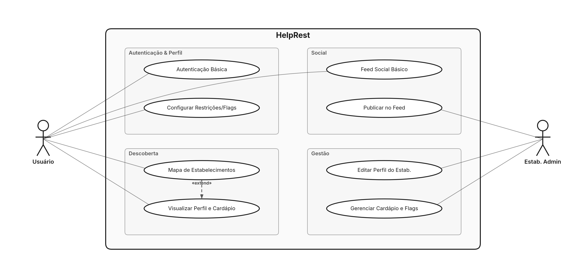

# Documentação HelpRest (MVP)

## 1. Link do GitHub
[https://github.com/GustavoLGregorio/helprest-monorepo](https://github.com/GustavoLGregorio/helprest-monorepo)

## 2. Formulário para Validação do App
*(Inserir link aqui)*

## 3. Diagrama de Casos de Uso (MVP)

## 4. Ferramentas e Tecnologias Utilizadas

**Linguagem e Runtime:**
- **TypeScript:** Linguagem base de todo o projeto (backend + mobile)
- **Bun:** Runtime do backend — HTTP server, scripts, test runner

**Frontend Mobile:**
- **React Native (0.79) / Expo SDK 53:** Framework de UI mobile e tooling
- **Expo Router:** Navegação file-based
- **TanStack Query:** Cache de server state, sincronização offline
- **MMKV:** Storage local criptografável e ultrarrápido
- **react-native-maps:** Integração com mapas

**Backend e Banco:**
- **Bun HTTP Server / Zod:** Servidor backend ultra rápido e validação estrita
- **MongoDB Atlas:** Banco NoSQL gerenciado
- **Redis (ioredis):** Cache distribuído e rate limiting
- **jose / Argon2:** Segurança JWT e hashing de senhas robusto

**Arquitetura e Padrões:**
- **Clean Architecture & DDD:** Camadas e modelagem de domínio
- **Monorepo:** `apps/mobile` + `apps/api`

## 5. Requisitos Funcionais e Não Funcionais (MVP)

**Requisitos Funcionais (Máx 6)**
1. **RF01 - Autenticação Básica:** O usuário deve poder se cadastrar e fazer login usando e-mail/senha ou Google OAuth.
2. **RF02 - Perfil com Restrições:** O usuário deve poder configurar seu perfil indicando suas restrições alimentares (flags).
3. **RF03 - Mapa de Estabelecimentos:** O sistema deve exibir um mapa iterável com pontos de restaurantes próximos que atendam às flags.
4. **RF04 - Perfil do Estabelecimento:** O usuário deve poder visualizar a página do restaurante, contendo dados básicos e cardápio.
5. **RF05 - Feed Social Básico:** O estabelecimento deve poder publicar avisos simples ou postagens no feed de usuários próximos.
6. **RF06 - Gestão de Cardápio:** O adm. do estabelecimento deve poder cadastrar/editar itens do cardápio e associar flags.

**Requisitos Não-Funcionais (Máx 6)**
1. **RNF01 - Usabilidade Mobile-First:** Interface nativa e fluida para dispositivos móveis (React Native).
2. **RNF02 - Desempenho do Mapa:** Renderização sem travamentos, com clusterização para alta densidade.
3. **RNF03 - Segurança de Senhas:** Armazenamento via algoritmos fortes de hash (Argon2id).
4. **RNF04 - Proteção de API:** Endpoints com validação JWT e rate limiting básico contra abusos.
5. **RNF05 - Escalabilidade do Banco:** MongoDB suportando buscas geoespaciais e queries rápidas por array de flags.
6. **RNF06 - Disponibilidade:** Backend (Bun) com reinicialização automática em caso de falhas, visando alto uptime.
